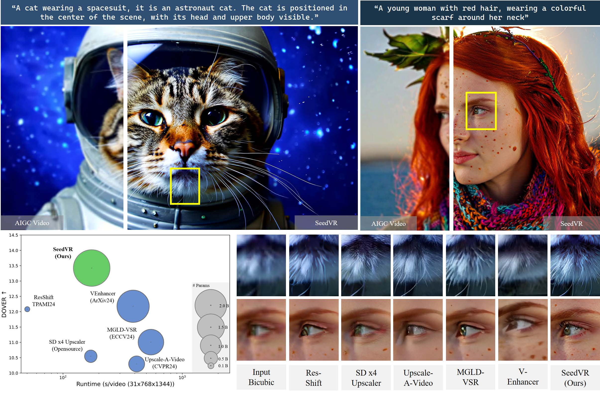

<div align="center">
  
</div>

<div align="center">

<h1>
    SeedVR:<br> 
    Seeding Infinity in Diffusion Transformer Towards Generic Video Restoration
</h1>

<div>
    <a href='https://iceclear.github.io' target='_blank'>Jianyi Wang<sup>1,2</sup></a>&emsp;
    <a href='https://scholar.google.com/citations?user=xXMj6_EAAAAJ&hl=zh-CN' target='_blank'>Zhijie Lin<sup>2</sup></a>&emsp;
    <a href='https://openreview.net/profile?id=~Meng_Wei11' target='_blank'>Meng Wei<sup>2</sup></a>&emsp;
    <a href='https://scholar.google.com/citations?user=uPmTOHAAAAAJ&hl=zh-CN' target='_blank'>Yang Zhao<sup>2</sup></a>&emsp;
    <a href='https://ceyuan.me/' target='_blank'>Ceyuan Yang<sup>2</sup></a>&emsp;
    <a href='https://openreview.net/profile?id=~Fei_xiao8' target='_blank'>Fei Xiao<sup>2</sup></a>&emsp;
    <a href='https://www.mmlab-ntu.com/person/ccloy/' target='_blank'>Chen Change Loy<sup>1</sup></a>&emsp;
    <a href='http://www.lujiang.info/' target='_blank'>Lu Jiang<sup>2</sup></a>
</div>
<div>
    <sup>1</sup>S-Lab, Nanyang Technological University&emsp;
    <sup>2</sup>ByteDance
</div>

<div>
    <strong>CVPR 2025 (Highlight)</strong>
</div>

<div>
    <h4 align="center">
        <a href="https://iceclear.github.io/projects/seedvr/" target='_blank'>
        
        </a>
        <a href="https://arxiv.org/abs/2501.01320" target='_blank'>
        
        </a>
        <a href="https://github.com/ByteDance-Seed/SeedVR">
            
        </a>
        <a href="https://huggingface.co/models?other=seedvr">
          
        </a>
        
    </h4>
</div>

<strong>SeedVR is a large diffusion-transformer model that is capable of restoring videos with any resolutions, <br> w/o relying on any additional diffusion prior.</strong>

<div style="width: 100%; text-align: center; margin:auto;">
    
</div>

---
</div>

## 🔥 Update
- [2025.06] 🔥🔥🔥 [Inference code](https://github.com/ByteDance-Seed/SeedVR/tree/main) and [model weights](https://huggingface.co/models?other=seedvr) released!
- [2025.03] Repo created. The open-source process depends on the company policy and we will keep updating the news in this page.

---

> **Why SeedVR:** *Conventional restoration models achieve inferior performance on both real-world and AIGC video restoration due to limited generation ability. Recent diffusion-based models improve the performance by introducing diffusion prior via ControlNet-like or adaptor-like architectures. Though gaining improvement, these methods generally suffer from constraints brought by the diffusion prior: these models suffer from the same bias as the prior, e.g., limited generation ability on small texts and faces, etc, and only work on fixed resolutions such as 512 or 1024. As a result, most of the existing diffusion-based restoration models rely on patch-based sampling, i.e., dividing the input video into overlapping spatial-temporal patches and fusing these patches using a Gaussian kernel at each diffusion step. The large overlap (e.g., 50\% of the patch size), required for ensuring a coherent output without visible patch boundaries, often leads to considerably slow inference speed. This inefficiency becomes even more pronounced when processing long videos at high resolutions. SeedVR follows SOTA video generation training pipelines to tackle the key challenge in diffusion-based restoration, i.e., by enabling arbitrary-resolution restoration w/o relying on any pretrained diffusion prior and introducing advanced video generation technologies suitable for video restoration. Serving as the largest-ever diffusion transformer model towards generic video restoration, we hope SeedVR could push the frontiers of advanced VR and inspire future research in developing large vision models for real-world video restoration.* 

## 📑 Citation

   If you find our repo useful for your research, please consider citing our paper:

   ```bibtex
   @inproceedings{wang2025seedvr,
      title={SeedVR: Seeding Infinity in Diffusion Transformer Towards Generic Video Restoration},
      author={Wang, Jianyi and Lin, Zhijie and Wei, Meng and Zhao, Yang and Yang, Ceyuan and Loy, Chen Change and Jiang, Lu},
      booktitle={CVPR},
      year={2025}
   }
   ```


## 📝 License

This project is under the copyright of [ByteDance Seed](https://github.com/ByteDance-Seed). Redistribution and use should get permission from [ByteDance Seed](https://github.com/ByteDance-Seed).


## 📧 Contact
If you have any questions, please feel free to reach us at `iceclearwjy@gmail.com`.
